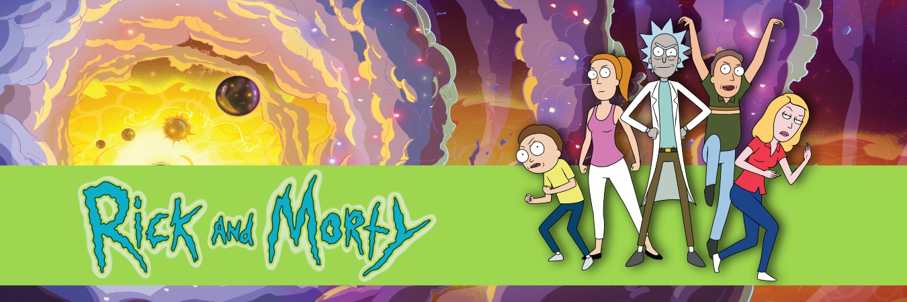

# spring-class-project-6

En esta práctica vamos a ver un ejemplo _end to end_ de desarrollo web usando elementos de _frontend_, _backend_ e integración con APIs de terceros. Se trabajarán los siguientes conceptos:
- Controladores
- Servicios
- Repositorios
- Bases de datos
- Conexión con fuentes de datos externas
- Mezcla de servicios locales y remotos
- Uso de vistas HTML

## 1. Objetivo
Queremos crear una aplicación web donde la gente pueda pueda buscar información sobre la serie de animación [Rick y Morty](https://es.wikipedia.org/wiki/Rick_y_Morty), valorar sus personajes favoritos y dejar comentarios y opiniones.

La aplicación deberá tener la siguiente funcionalidad:
1. Un formulario de búsqueda donde el usuario pueda introducir los valores de consulta.
2. Una página que muestre la lista de personajes que coinciden con una consulta.
3. Una página con información detallada sobre el personaje seleccionado, con su imagen, nombre, descripción, valoración y comentarios de los usuarios.

## 2. Elementos de la web

### 2.1. Buscador

El buscador debe presentarse como una vista HTML al cargar la ruta `/search`. Deberá mostrar un formulario con los siguientes datos:
- Nombre del personaje
- Estado (Vivo, Muerto o indeterminado)
- Especie (Humano o Alien)
- Tipo
- Género (Masculino, femenino o indeterminado)
- Número de registros por página

El formulario tendrá un botón "Enviar", que al ser pulsado, enviará el contenido del formulario al _endpoint_ `/results`, usando el método POST. Esto hará que se cargue la lista de resultados devuelta por dicho endpoint.

### 2.2. Lista de resultados

Al hacer POST con los datos de búsqueda en el _endpoint_ `/results`, el controlador consultará a un servicio para obtener la información requerida. Como resultado, el controlador devolverá una vista cargada con los resultados anteriores y los presentará al usuario. La información que deberá presentarse al usuario es:
- Total de resultados encontrados
- Número de páginas de resultados
- Página actual
- Lista de resultados
    - Nombre del personaje
    - Descripción breve (limitada a 16 palabras)
    - Origen del personaje
    - Un botón o enlace para acceder a la ficha del personaje, esto redirigirá al usuario al _endpoint_ `/character/{id}`
- Paginador de resultados
    - Botón o enlace para ir a la primera página
    - Botón o enlace para ir a la página anterior
    - Botón o enlace para ir a la primera siguiente
    - Botón o enlace para ir a la última página

### 2.3. Información del personaje

Esta vista se cargará al acceder al _endpoint_ `/character/{id}`. En primer lugar, el controlador accederá al servicio de información de que disponga para obtener los datos del personaje cuyo identificador sea `id`. Luego, cargará la vista HTML adecuada y, usando como modelo el personaje encontrado, la devolverá al usuario. La información que debe mostrarse es:
- Retrato del personaje
- Identificador del personaje
- Nombre
- Estado (vivo/muerto/desconocido)
- Especie (Humano/Alien)
- Tipo (si lo hubiera)
- Género (Hombre/Mujer/Indefinido)
- Nombre del lugar de origen
- Último lugar conocido
- Lista numérica de los episodios en los que aparece
- Valoración media de los usuarios
- Valoración de cada usuario
    - Nombre del usuario que efectua la valoración
    - Puntuación
    - Comentario (opcional)
- Botón o enlace de **Enviar una valoración**. Al hacer clic en este botón, se redirigirá al usuario al _endpoint_ `GET /character/{id}/rate`, que permite agregar una valoración al personaje.

### 2.3.1 Sistema de valoración y comentarios de un personaje

Al acceder a `GET /character/{id}/rate`, se devolverá una vista que permitirá al usuario dejar una valoración del personaje con identificador `id`. La vista HTML presentará un formulario con la siguiente información:
- Nombre del personaje que se está valorando
- Puntuación (del 1 al 10)
- Nombre de la persona que deja la valoración
- Texto con un comentario del usuario (opcional)
- Un botón **Enviar**, que mandará el formulario al _endpoint_ `POST /character/{id}/rate`

Cuando se envía el formulario a `POST /character/{id}/rate`, el sistema registrará en la base de datos la información facilitada, que será usada en futuras consultas para obtener la valoración media de cada personaje y la lista de comentarios de los usuarios.

## 3. Servicio de información de personajes

Para obtener toda la información de los personajes de la serie crearemos un servicio Spring que se encargará de comunicarse con una API externa donde estará almacenada la información. El servicio deberá mediar entre la información suministrada por el usuario a través de los controladores y el _input_ que la API externa requiere del programador. 

A priori, el servicio deberá tener los siguientes métodos:
- Búsqueda paginada de personajes
- Obtener un personaje por ID

### 3.1 The Rick and Morty API

La [API de Rick y Morty](https://rickandmortyapi.com/) es una API desarrollada por [Axel Fuhrmann](https://github.com/afuh) que recopila información jerárquica y navegable sobre el universo de la serie. La API provee acceso a los siguientes elementos:
- Personajes
- Ubicaciones
- Episodios

Para este ejercicio solo será necesario acceder al _endpoint_ que nos facilita información sobre los personajes de la serie. El **esquema**, **endpoint** y **ejemplos** de consulta de personajes pueden obtenerse aquí: [Character endpoint](https://rickandmortyapi.com/documentation/#character)

> **Nota**: Este servicio no requiere persistencia de ningún tipo

## 4. Servicio de valoración de personajes

Aunque la información de personajes la obtenemos de una fuente externa necesitaremos una forma de conservar en local las valoraciones y puntuaciones que los usuarios dejan en los personajes. Así pues, habrá que crear un servicio que ofrezca dicha funcionalidad. Los requerimientos son los siguientes:
- Debe permitir añadir una **valoración** a un personaje
- Debe permitir obtener el promedio de la **puntuación** de un personaje
- Debe permitir obtener todas las valoraciones de un personaje

La valoración de un personaje consta de los siguientes elementos:
- Identificador único del personaje
- Puntuación (1-10)
- Nombre del usuario que ofrece la valoración
- Opinion (opcional)

> **Nota**: Para dar funcionalidad al servicio habrá que crear las entidades y repositorios necesarios.

## 5. Notas de implementación

Este ejercicio es libre, se pueden tomar las decisiones de diseño que se crean oportunas. No obstante, aquí se detallan algunas recomendaciones:
- El ejercicio está planteado como una web multipágina (recomendado). Sin embargo, sería posible crear una SPA con JavaScript y algún framework (React, Angular, Vue, etc.). Para hacer esto habría que reestructurar los controladores para convertirlos en una API Rest. 
- Las vistas pueden ser HTML básico, JSP o un motor de plantillas como Thymeleaf.
- Se puede optar por unificar todos los endpoints en un único controlador o separarlos funcionalmente en varios
- Debe haber necesariamente dos servicios separados: consulta de personajes y valoración de personajes.

## 6. Bibliografía
- [A guide to RestClient in Spring Boot](https://www.baeldung.com/spring-boot-restclient)
- [Model, ModelMap, and ModelAndView in Spring MVC](https://www.baeldung.com/spring-mvc-model-model-map-model-view)
- [The Rick and Morty API](https://rickandmortyapi.com/documentation)
- [HTML Forms](https://www.w3schools.com/html/html_forms.asp)